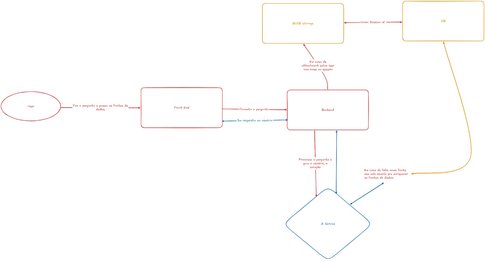

# FATEC Profº Jessen Vidal - São José dos Campos - 6º Semestre DSM - 2026

Projeto desenvolvido para a API (Aprendizagem por Projeto Integrado) do 6° Semestre do curso Desenvolvimento de Software Multiplataforma (DSM) em parceria com a GSW.

> _A API se trata de um projeto submetido à metodologia de ensino em implantação na Fatec São José dos Campos, do qual os alunos formam equipes baseadas na metodologia ágil SCRUM, tendo um aluno como Scrum Master, um sendo o Product Owner e o restante dos integrantes como Dev Team._

<!-- [PREENCHER] Substituir pelo banner real do projeto (docs/chatinbanner.jpg) -->

---

### 📃 Repositórios
- [Repositório App](#) <!-- [PREENCHER] -->
- [Repositório BackEnd](#) <!-- [PREENCHER] -->
- [Repositório BD](#) <!-- [PREENCHER] -->

---

## 📑 Sumário
- [Dores do Cliente](#dores)
- [Visão do Projeto](#visao-do-projeto)
- [Cronograma do Projeto](#cronograma)
- [Tecnologias utilizadas](#tecnologias)
- [Padrões de Commit](#padrao)
- [Requisitos](#requisitos)
- [Arquitetura](#arquitetura)
- [Wireframes](#wireframes)
- [Product Backlog](#backlog)
- [Sprint Backlog](#backsprint)
- [Links úteis](#links)
- [Equipe](#equipe)

---

## 🏥 Dores do Cliente 

### Verificar
Problemas relacionados ao acompanhamento do próprio estudo:

- Dificuldade em identificar o nível real de conhecimento em cada matéria antes de começar a estudar.
- Falta de clareza sobre o que estudar a cada momento, diante do grande volume de conteúdo do vestibular.
- Ausência de acompanhamento contínuo da própria evolução ao longo da preparação.
- Falta de feedback imediato sobre erros e acertos nas atividades realizadas.
- Perda de motivação por não perceber progresso de forma tangível.

### Planejar
Problemas relacionados à organização da rotina de estudos:

- Dificuldade em montar uma rotina de estudos adequada ao tempo restante até a prova.
- Dificuldade em priorizar matérias e tópicos com maior déficit de conhecimento.
- Custo elevado de cursinhos e mentorias particulares para um acompanhamento personalizado.
- Falta de engajamento contínuo, levando ao abandono do plano de estudos.
- Necessidade de uso consciente de IA, considerando restrições de custo e limite de uso.

### Controlar
Problemas relacionados à gestão do progresso e dos recursos do sistema:

- Falta de indicadores claros de progresso e desempenho ao longo do tempo.
- Dificuldade em verificar se o plano de estudos está de fato sendo seguido.
- Ausência de um histórico consultável de atividades e resultados anteriores.
- Necessidade de garantir que o sistema continue funcional mesmo com a IA indisponível.
- Necessidade de controlar e limitar o consumo (chamadas/tokens) de IA.

---

## 👁 Visão do Projeto 

O CHATin é um <b>coach de estudos via chat com IA</b>, com foco inicial em conteúdo do ENEM: o estudante conversa livremente sobre o que está estudando, e o sistema <b>reconhece automaticamente a matéria e o tópico</b> discutidos, dentro de um conjunto fixo de conteúdos do ENEM. A qualquer momento, o estudante pode pedir um <b>resumo</b> da conversa, que fica salvo na <b>Biblioteca</b> — um repositório pessoal e privado. O sistema também gera <b>questionários com gabarito</b> sobre o tópico identificado, corrige as respostas automaticamente, e <b>registra o progresso do estudante por matéria e tópico</b>, usando o resultado do primeiro questionário como referência inicial de desempenho. Nas etapas seguintes, esse histórico passa a ser usado ativamente: os próximos questionários se ajustam à dificuldade que o estudante demonstrar, e o sistema passa a <b>recomendar proativamente</b> o que estudar a seguir. O chat nunca sugere assunto por conta própria — é sempre o estudante quem dá o ponto de partida da conversa.

---

## Cronograma de Sprints 

| Sprint | Período | Status | Relatório |
|:------:|:-------:|:------:|:---------:|
| 1 | 07/09/2026 à 27/09/2026 | Em Andamento | [Ver Relatório](https://github.com/Equipe-Skyfall/chatin/tree/main/docs/sprint1) |
| 2 | 05/10/2026 à 25/10/2026 | Não iniciado | — |
| 3 | 02/11/2026 à 22/11/2026 | Não iniciado | — |

---

## 💻 Tecnologias utilizadas 

| Tecnologia | Finalidade |
|:----------:|------------|
|    | Frontend / App |
|   | Backend / API |
|  | Banco de Dados |
|  | Provedor de IA / PLN |
|  | Interface / Design e prototipação |
|  | Empacotamento / Deploy |

---

### 📃 Estrutura de Branches
- **Main** — Estado principal que armazena a versão estável do projeto
- **Dev** — Estado de desenvolvimento atual

### ⬜ Status do projeto: 0/3 Sprints

---

## 💻 Padrões de Commit 

**FEAT**: Adiciona um novo recurso ou funcionalidade.
> Exemplo: `FEAT - Adição do diagnóstico inicial`

**FIX**: Corrige um bug.
> Exemplo: `FIX - Corrige o cálculo de XP após atividade`

**CHORE**: Atualizações de manutenção que não alteram a lógica de negócio ou visual.
> Exemplo: `CHORE - Atualização das dependências do Node.js`

**DOCS**: Altera a documentação.
> Exemplo: `DOCS - Atualiza README com informações sobre novas rotas`

**STYLE**: Modifica a formatação do código sem alterar a lógica.
> Exemplo: `STYLE - Adiciona comentários no código para facilitar a leitura`

**REFACTOR**: Refatora o código sem adicionar funcionalidades ou corrigir bugs.
> Exemplo: `REFACTOR - Refatora o serviço de jornada, deixando-o mais legível`

**TEST**: Adiciona, modifica ou remove testes.
> Exemplo: `TEST - Adiciona teste para o cálculo de nível`

**PERF**: Melhora a performance.
> Exemplo: `PERF - Otimiza a consulta de histórico de atividades`

**REVERT**: Reverte um commit anterior.
> Exemplo: `REVERT - Reverte a adição do cache de respostas da IA`

**HOTFIX**: Corrige um bug crítico em produção de forma urgente.
> Exemplo: `HOTFIX - Corrige vazamento de chave de API no cliente`

> **Nomenclatura de variáveis:** padrão `camelCase` (ex: `nomeCompleto`).

---

## 📋 Requisitos 

### Requisitos Funcionais

| RF | Nome | Descritivo |
|----|------|------------|
| RF1 | Cadastro e Login | O sistema deve permitir que o estudante crie uma conta (com apelido) e faça login. |
| RF2 | Chat com o Coach de IA | O sistema deve permitir uma conversa livre entre o estudante e o assistente, sempre iniciada pelo estudante. |
| RF3 | Reconhecimento Automático de Matéria e Tópico | O sistema deve identificar, a partir da conversa, a matéria e o tópico discutidos, dentro de um conjunto fixo de conteúdos do ENEM. |
| RF4 | Geração de Resumo | O sistema deve gerar, sob pedido, um resumo da conversa e salvá-lo automaticamente na Biblioteca. |
| RF5 | Biblioteca de Resumos | O sistema deve permitir listar, abrir e revisar os resumos salvos pelo estudante. |
| RF6 | Geração de Questionário e Gabarito | O sistema deve gerar um questionário com gabarito sobre o tópico identificado na conversa. |
| RF7 | Correção do Questionário | O sistema deve corrigir automaticamente as respostas do estudante comparando com o gabarito. |
| RF8 | Registro de Progresso por Matéria/Tópico | O sistema deve registrar o progresso do estudante por matéria e tópico, usando o resultado dos questionários como referência de desempenho. |
| RF9 | Ajuste de Dificuldade do Questionário | O sistema deve ajustar a dificuldade dos próximos questionários de um tópico com base no desempenho do estudante ali. |
| RF10 | Recomendação Proativa de Próximo Passo | O sistema deve usar o histórico de progresso para recomendar ativamente ao estudante o que estudar a seguir. |
| RF11 | Busca e Citação de Fontes Externas | O sistema deve buscar fontes confiáveis na web sobre o assunto da conversa e indicar de onde a informação foi retirada. |
| RF12 | Anexar Documentos ao Chat | O sistema deve permitir que o estudante envie documentos para auxiliar a IA durante a conversa. |
| RF13 | Gamificação — XP | O sistema deve conceder XP ao estudante a cada questionário concluído. |
| RF14 | Gamificação — Streak de Estudos | O sistema deve contar a sequência de dias consecutivos em que o estudante respondeu ao menos um questionário. |
| RF15 | Percentual Médio de Acerto | O sistema deve calcular e exibir a % média de acerto do estudante nos questionários. |
| RF16 | Ranking entre Usuários | O sistema deve exibir um ranking comparando o XP dos estudantes, identificados por apelido. |
| RF17 | Contagem de Cards Revisados | O sistema deve contar quantos resumos da Biblioteca o estudante já revisou. |

### Requisitos Não Funcionais

| RNF | Nome | Descritivo |
|-----|------|------------|
| RNF1 | Manual de Instalação | Documentação obrigatória (Fatec) explicando como instalar e rodar o projeto. |
| RNF2 | Manual do Usuário | Documentação obrigatória (Fatec) explicando como usar a aplicação. |
| RNF3 | Documentação da API | Documentação dos principais endpoints/integrações da API. |
| RNF4 | Modelagem de Dados | Modelo do banco de dados ou estrutura de persistência utilizada, documentado. |
| RNF5 | Segurança de Segredos | Chaves e segredos de APIs externas não podem ficar hardcoded no código-fonte. |
| RNF6 | Resiliência à Falha de IA | A aplicação deve continuar funcional (Biblioteca, resumos salvos, desempenho registrado) mesmo com a IA indisponível ou cota esgotada. |
| RNF7 | Controle de Consumo de IA | O sistema deve registrar e exibir o consumo de IA (nº de chamadas e, quando disponível, tokens). |
| RNF8 | Redução de Consumo de IA | O sistema deve aplicar ao menos uma estratégia de redução de consumo (ex.: memória resumida do estudante em vez de reenviar histórico completo). |
| RNF9 | Privacidade da Biblioteca e Conversas | Resumos salvos na Biblioteca e o histórico de conversas do chat são estritamente privados por usuário; o Ranking (RF16) expõe apenas apelido e XP, nunca o conteúdo estudado. |

---

## 🏗 Arquitetura 

---

## 🖥 Wireframes 

- [Wireframe do produto](docs/wireframe/Wireframe_CHATin.pdf)

---

## 📜 Product Backlog 

| RANK | SPRINT | PRIORIDADE | ESTIMATIVA | USER STORY | RF | STATUS |
|:----:|:------:|:----------:|:----------:|------------|:--:|:------:|
| 1 | 1 | Alta | 8 | Como estudante, quero conversar livremente com o Coach sobre o que estou estudando, para tirar dúvidas e receber apoio sobre o assunto que eu trouxer. | RF2 | ⬜ |
| 2 | 1 | Alta | 8 | Como estudante, quero que o sistema reconheça automaticamente a matéria e o tópico que estou discutindo, para não precisar categorizar isso manualmente. | RF3 | ⬜ |
| 3 | 1 | Alta | 5 | Como estudante, quero pedir para o Coach gerar um resumo da conversa a qualquer momento, para guardar o conteúdo estudado. | RF4 | ⬜ |
| 4 | 1 | Alta | 5 | Como estudante, quero acessar uma biblioteca com todos os resumos que já salvei, para revisar o que estudei quando quiser. | RF5 | ⬜ |
| 5 | 1 | Alta | 8 | Como estudante, quero receber um questionário com gabarito sobre o tópico que venho estudando na conversa, para testar meu entendimento. | RF6 | ⬜ |
| 6 | 1 | Alta | 5 | Como estudante, quero responder o questionário e ver minha correção automática, para saber o que acertei e errei. | RF7 | ⬜ |
| 7 | 1 | Alta | 5 | Como estudante, quero que meu progresso seja registrado por matéria e tópico, usando meu desempenho no questionário como referência inicial, para acompanhar minha evolução ao longo do tempo. | RF8 | ⬜ |
| 8 | 2 | Alta | 8 | Como estudante, quero que os próximos questionários fiquem mais fáceis ou mais difíceis de acordo com meu desempenho no tópico, para estudar no nível certo para mim. | RF9 | ⬜ |
| 9 | 2 | Alta | 8 | Como estudante, quero que o sistema me recomende ativamente o que estudar a seguir, com base no meu histórico de progresso, para saber qual deve ser meu próximo passo. | RF10 | ⬜ |
| 10 | 2 | Média | 8 | Como estudante, quero que o assistente busque fontes confiáveis sobre o assunto da conversa e sempre me mostre de onde tirou a informação, para confiar no que está sendo dito. | RF11 | ⬜ |
| 11 | 2 | Média | 5 | Como estudante, quero anexar documentos à conversa, para que o assistente use esse material como apoio ao me responder. | RF12 | ⬜ |
| 12 | 2 | Média | 5 | Como estudante, quero ganhar XP ao concluir um questionário, para acompanhar meu progresso de forma gamificada. | RF13 | ⬜ |
| 13 | 2 | Alta | 5 | Como estudante, quero que meus resumos salvos e meu histórico de progresso continuem acessíveis mesmo se a IA estiver indisponível, para não perder o que já estudei. | RNF6 | ⬜ |
| 14 | 3 | Média | 5 | Como estudante, quero manter uma sequência de dias respondendo questionários (streak), para me sentir motivado a continuar estudando. | RF14 | ⬜ |
| 15 | 3 | Média | 5 | Como estudante, quero ver minha porcentagem média de acerto nos questionários, para entender meu nível geral de desempenho. | RF15 | ⬜ |
| 16 | 3 | Média | 8 | Como estudante, quero ver um ranking com o XP de outros estudantes (por apelido), para me sentir motivado a competir de forma saudável. | RF16 | ⬜ |
| 17 | 3 | Baixa | 5 | Como estudante, quero que o sistema conte quantos resumos da minha biblioteca eu já revisei, para acompanhar meu hábito de revisão. | RF17 | ⬜ |
| 18 | 3 | Alta | 5 | Como administrador, quero visualizar o consumo de chamadas e tokens de IA, para controlar custo e uso do recurso. | RNF7 | ⬜ |
| 19 | 3 | Alta | 5 | Como estudante, quero que o assistente use um resumo do meu histórico em vez de reenviar tudo para a IA a cada interação, para economizar consumo sem perder contexto relevante. | RNF8 | ⬜ |

---

## 📝 Sprint Backlog 

> Os Critérios de Aceitação abaixo também estão detalhados, junto das Regras de Negócio, no [DoR (PDF)](docs/DoR_CHATin.pdf).

<strong>Sprint 1 — Núcleo: Chat, Reconhecimento de Tópico e Questionário</strong>

 

> **Período:** 07/09/2026 à 27/09/2026
> **Foco:** O estudante conversa livremente com o Coach, que reconhece automaticamente a matéria/tópico (ENEM), gera resumos salvos na Biblioteca, e o estudante responde um questionário sobre o tópico com correção automática — o resultado já serve de referência inicial de progresso.

| RANK | PRIORIDADE | ESTIMATIVA | USER STORY | RF | STATUS |
|:----:|:----------:|:----------:|------------|:--:|:------:|
| 1 | Alta | 8 | Como estudante, quero conversar livremente com o Coach sobre o que estou estudando, para tirar dúvidas e receber apoio sobre o assunto que eu trouxer. | RF2 | ⬜ |
| 2 | Alta | 8 | Como estudante, quero que o sistema reconheça automaticamente a matéria e o tópico que estou discutindo, para não precisar categorizar isso manualmente. | RF3 | ⬜ |
| 3 | Alta | 5 | Como estudante, quero pedir para o Coach gerar um resumo da conversa a qualquer momento, para guardar o conteúdo estudado. | RF4 | ⬜ |
| 4 | Alta | 5 | Como estudante, quero acessar uma biblioteca com todos os resumos que já salvei, para revisar o que estudei quando quiser. | RF5 | ⬜ |
| 5 | Alta | 8 | Como estudante, quero receber um questionário com gabarito sobre o tópico que venho estudando na conversa, para testar meu entendimento. | RF6 | ⬜ |
| 6 | Alta | 5 | Como estudante, quero responder o questionário e ver minha correção automática, para saber o que acertei e errei. | RF7 | ⬜ |
| 7 | Alta | 5 | Como estudante, quero que meu progresso seja registrado por matéria e tópico, usando meu desempenho no questionário como referência inicial, para acompanhar minha evolução ao longo do tempo. | RF8 | ⬜ |

---

US01 — Chat livre com o Coach

**Critérios de Aceitação**
- [ ] O sistema deve permitir que o estudante envie mensagens de texto livre a qualquer momento.
- [ ] O assistente deve responder de forma coerente com o assunto trazido pelo estudante.
- [ ] O assistente não deve iniciar um novo assunto por conta própria — a conversa sempre parte do estudante.

US02 — Reconhecimento automático de matéria e tópico

**Critérios de Aceitação**
- [ ] O sistema deve identificar a matéria e o tópico discutidos a partir do conteúdo da conversa, sem exigir que o estudante os informe manualmente.
- [ ] A matéria e o tópico identificados devem pertencer a um conjunto fixo de conteúdos do ENEM.
- [ ] Caso a conversa não se encaixe em nenhuma matéria/tópico do conjunto fixo, o sistema deve continuar respondendo normalmente, sem travar por falta de classificação.

US03 — Geração de resumo da conversa

**Critérios de Aceitação**
- [ ] O estudante deve poder solicitar a geração de um resumo a qualquer momento durante a conversa.
- [ ] O resumo gerado deve ser salvo automaticamente como um novo item na Biblioteca.
- [ ] O resumo deve refletir o conteúdo discutido até o momento do pedido.

US04 — Biblioteca de resumos salvos

**Critérios de Aceitação**
- [ ] A Biblioteca deve listar todos os resumos salvos pelo estudante, com título e data.
- [ ] O estudante deve poder abrir um resumo salvo para revisão a qualquer momento.
- [ ] A Biblioteca deve ser acessível apenas pelo próprio estudante (privada).

US05 — Geração de questionário e gabarito

**Critérios de Aceitação**
- [ ] O questionário deve ser gerado com base no tópico identificado na conversa (RF3).
- [ ] Cada questão deve ter um gabarito associado, gerado junto com o questionário.
- [ ] O questionário deve conter uma quantidade mínima de questões definida pela equipe.

US06 — Correção automática do questionário

**Critérios de Aceitação**
- [ ] O estudante deve poder responder o questionário diretamente no aplicativo.
- [ ] O sistema deve corrigir automaticamente as respostas comparando com o gabarito.
- [ ] O estudante deve visualizar quais questões acertou e errou ao final.

US07 — Registro de progresso por matéria/tópico

**Critérios de Aceitação**
- [ ] O primeiro questionário respondido em uma matéria/tópico deve ser registrado como referência inicial de desempenho.
- [ ] O progresso deve ser registrado de forma específica por matéria e tópico, não apenas como uma métrica geral de uso.
- [ ] O histórico de progresso deve ficar vinculado ao perfil do estudante e ser consultável.

---

<strong>Sprint 2 — Adaptação, Histórico e Enriquecimento do Chat</strong>

 

> **Período:** 05/10/2026 à 25/10/2026
> **Foco:** O sistema passa a reagir ao desempenho do estudante (ajustando a dificuldade) e a recomendar proativamente o próximo passo com base no histórico. O chat ganha busca de fontes externas e anexo de documentos, com gamificação básica (XP) e resiliência caso a IA falhe.

| RANK | PRIORIDADE | ESTIMATIVA | USER STORY | RF | STATUS |
|:----:|:----------:|:----------:|------------|:--:|:------:|
| 8 | Alta | 8 | Como estudante, quero que os próximos questionários fiquem mais fáceis ou mais difíceis de acordo com meu desempenho no tópico, para estudar no nível certo para mim. | RF9 | ⬜ |
| 9 | Alta | 8 | Como estudante, quero que o sistema me recomende ativamente o que estudar a seguir, com base no meu histórico de progresso, para saber qual deve ser meu próximo passo. | RF10 | ⬜ |
| 10 | Média | 8 | Como estudante, quero que o assistente busque fontes confiáveis sobre o assunto da conversa e sempre me mostre de onde tirou a informação, para confiar no que está sendo dito. | RF11 | ⬜ |
| 11 | Média | 5 | Como estudante, quero anexar documentos à conversa, para que o assistente use esse material como apoio ao me responder. | RF12 | ⬜ |
| 12 | Média | 5 | Como estudante, quero ganhar XP ao concluir um questionário, para acompanhar meu progresso de forma gamificada. | RF13 | ⬜ |
| 13 | Alta | 5 | Como estudante, quero que meus resumos salvos e meu histórico de progresso continuem acessíveis mesmo se a IA estiver indisponível, para não perder o que já estudei. | RNF6 | ⬜ |

---

US08 — Ajuste de dificuldade do questionário

**Critérios de Aceitação**
- [ ] O sistema deve considerar o desempenho do estudante no tópico ao gerar o próximo questionário sobre aquele tópico.
- [ ] Um desempenho bom deve resultar em questões de dificuldade igual ou maior; um desempenho fraco deve resultar em questões de reforço.
- [ ] O ajuste de dificuldade deve ser perceptível ao estudante (ex.: indicação do nível do questionário).

US09 — Recomendação proativa do próximo passo

**Critérios de Aceitação**
- [ ] O sistema deve sugerir ativamente ao estudante o que estudar a seguir, com base no histórico de progresso por matéria/tópico.
- [ ] A recomendação deve priorizar matérias/tópicos com desempenho mais fraco ou ainda não estudados.
- [ ] O estudante deve poder ignorar a recomendação e continuar a conversa livremente sobre outro assunto.

US10 — Busca e citação de fontes externas

**Critérios de Aceitação**
- [ ] O sistema deve buscar fontes relacionadas ao assunto da conversa quando necessário para embasar a resposta.
- [ ] Toda resposta que utilizar uma fonte externa deve indicar de onde a informação foi retirada.
- [ ] As fontes citadas devem ser verificáveis (título e/ou link).

US11 — Anexar documentos à conversa

**Critérios de Aceitação**
- [ ] O estudante deve poder anexar um documento à conversa a qualquer momento.
- [ ] O conteúdo do documento anexado deve ser considerado pelo assistente nas respostas seguintes.
- [ ] Documentos em formato não suportado devem exibir mensagem de erro clara.

US12 — Ganho de XP por questionário concluído

**Critérios de Aceitação**
- [ ] O estudante deve ganhar XP ao concluir um questionário.
- [ ] O sistema deve exibir o XP atual do estudante.
- [ ] O cálculo de XP deve ser feito pela aplicação, não pela IA.

US13 — Resiliência à falha de IA

**Critérios de Aceitação**
- [ ] A Biblioteca e o registro de progresso devem continuar acessíveis mesmo com a IA indisponível.
- [ ] O chat deve sinalizar claramente quando não conseguir gerar uma resposta.
- [ ] Nenhuma funcionalidade não dependente de IA deve ficar bloqueada por essa falha.

---

<strong>Sprint 3 — Desempenho Social e Governança de IA</strong>

 

> **Período:** 02/11/2026 à 22/11/2026
> **Foco:** O estudante acompanha streak, % média de acerto, ranking entre usuários (por apelido) e cards revisados, enquanto a equipe garante controle e redução de consumo de IA.

| RANK | PRIORIDADE | ESTIMATIVA | USER STORY | RF | STATUS |
|:----:|:----------:|:----------:|------------|:--:|:------:|
| 14 | Média | 5 | Como estudante, quero manter uma sequência de dias respondendo questionários (streak), para me sentir motivado a continuar estudando. | RF14 | ⬜ |
| 15 | Média | 5 | Como estudante, quero ver minha porcentagem média de acerto nos questionários, para entender meu nível geral de desempenho. | RF15 | ⬜ |
| 16 | Média | 8 | Como estudante, quero ver um ranking com o XP de outros estudantes (por apelido), para me sentir motivado a competir de forma saudável. | RF16 | ⬜ |
| 17 | Baixa | 5 | Como estudante, quero que o sistema conte quantos resumos da minha biblioteca eu já revisei, para acompanhar meu hábito de revisão. | RF17 | ⬜ |
| 18 | Alta | 5 | Como administrador, quero visualizar o consumo de chamadas e tokens de IA, para controlar custo e uso do recurso. | RNF7 | ⬜ |
| 19 | Alta | 5 | Como estudante, quero que o assistente use um resumo do meu histórico em vez de reenviar tudo para a IA a cada interação, para economizar consumo sem perder contexto relevante. | RNF8 | ⬜ |

---

US14 — Streak de dias de estudo

**Critérios de Aceitação**
- [ ] O sistema deve contar a sequência de dias consecutivos em que o estudante respondeu ao menos um questionário.
- [ ] O streak deve ser exibido de forma visível na tela de Desempenho.
- [ ] A quebra do streak deve reiniciar a contagem a zero.

US15 — Percentual médio de acerto

**Critérios de Aceitação**
- [ ] O sistema deve calcular a % média de acerto com base em todos os questionários respondidos.
- [ ] O valor deve ser atualizado automaticamente a cada novo questionário concluído.
- [ ] A % deve ser exibida na tela de Desempenho.

US16 — Ranking entre usuários

**Critérios de Aceitação**
- [ ] O ranking deve exibir os estudantes ordenados por XP, do maior para o menor.
- [ ] O ranking deve identificar cada estudante apenas pelo apelido, nunca pelo nome real.
- [ ] O estudante deve conseguir identificar sua própria posição no ranking.

US17 — Contagem de cards revisados

**Critérios de Aceitação**
- [ ] O sistema deve contar quantas vezes o estudante abriu um resumo da Biblioteca para revisão.
- [ ] A contagem deve ser exibida na tela de Desempenho.
- [ ] Revisar o mesmo resumo mais de uma vez deve incrementar a contagem.

US18 — Controle de consumo de IA

**Critérios de Aceitação**
- [ ] O sistema deve registrar cada chamada feita à IA (data/hora e funcionalidade de origem).
- [ ] Quando disponível pelo provedor, o sistema deve registrar também a quantidade de tokens usados.
- [ ] O administrador deve conseguir visualizar um resumo do consumo por período.

US19 — Redução de consumo de IA

**Critérios de Aceitação**
- [ ] O sistema deve manter um resumo do histórico do estudante em vez do histórico completo.
- [ ] As chamadas à IA devem usar essa versão resumida como contexto.
- [ ] Deve ser possível demonstrar a redução de consumo obtida com a estratégia escolhida.

---

## Links Úteis 

- [Desafio do Parceiro Acadêmico (GSW)](docs/Desafio%20do%20Parceiro%20Academico%206DSM%20-%20GSW%20-%20final.pdf)

---

## 👥 Equipe 

| Foto | Função | Nome | LinkedIn | GitHub |
|:----:|:------:|:----:|:--------:|:------:|
|  | Dev Team | Eduardo da Silva Fontes | [LinkedIn](https://www.linkedin.com/in/eduardo-da-silva-fontes/) | [GitHub](https://github.com/DuuhZero) |
|  | Dev Team | Eduardo Kuwahara Jr. | [LinkedIn](https://www.linkedin.com/in/eduardo-kuwahara-3b2267303/) | [GitHub](https://github.com/EduardoKuwahara) |
|  | Dev Team | Fábio Hiroshi | [LinkedIn](https://www.linkedin.com/in/f%C3%A1bio-hiroshi-5393a51a0) | [GitHub](https://github.com/FabioHiros) |
|  | Product Owner | João Vitor Rossi Ferreira | [LinkedIn](https://www.linkedin.com/in/joão-rossi-7311a0301/) | [GitHub](https://github.com/joaorossiferreira) |
|  | Dev Team | Kathellyn Caroline Alves dos Santos | [LinkedIn](https://www.linkedin.com/in/kathellyn-caroline-a562101b9) | [GitHub](https://github.com/CarolineKathellyn) |
|  | Dev Team | Victor Daniel | [LinkedIn](https://www.linkedin.com/in/victor-daniel-ramos-bessa-1436a3215/) | [GitHub](https://github.com/victordanielrb) |
|  | Scrum Master | Paulo Henrique Martins de Almeida | [LinkedIn](https://www.linkedin.com/in/paulo-almeida-3102452a7/) | [GitHub](https://github.com/pauloalmeida46) |